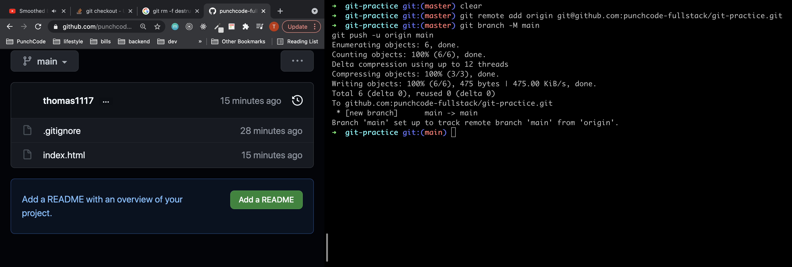
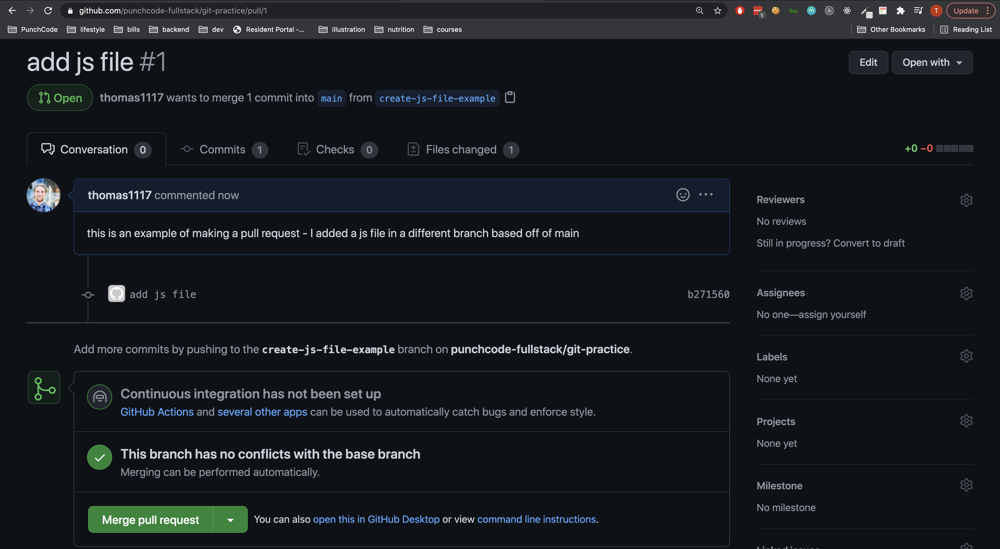
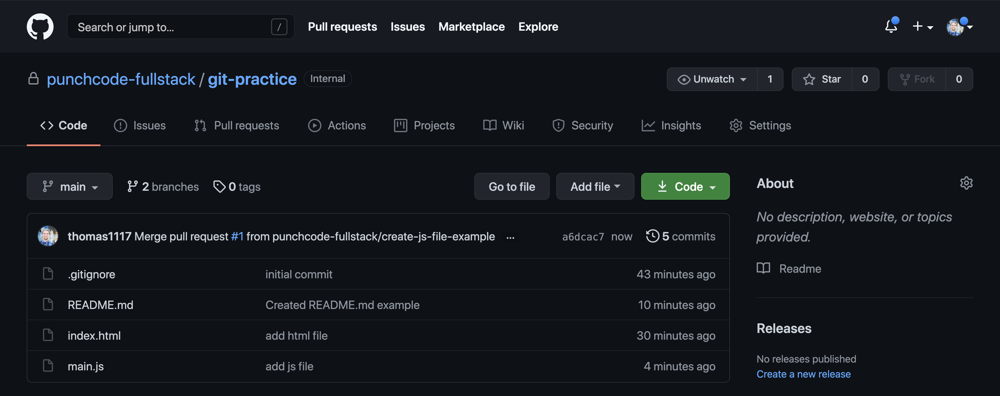
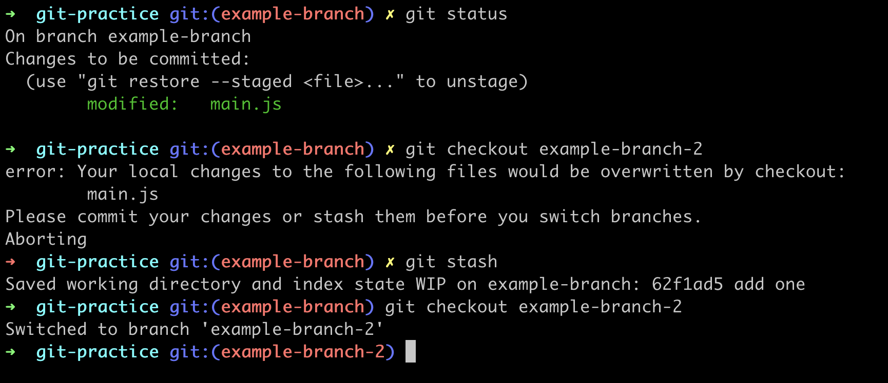
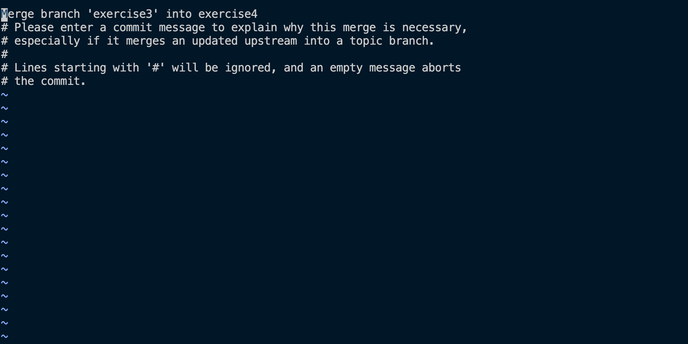

# this is a dive into some common commands

- a quick note this in no way an extensive list of commands
- merely some commands in a real world repo
- I'd like to note the descriptions here are lacking you can investigate the commands further with the power of google!

- here's a nice article that explains the different lifecycles of git

https://dev.to/sublimegeek/git-staging-area-explained-like-im-five-1anh

## GUI tool

- in class we used a lot of terminal stuff when interacting with git, which is fine - but when doing more complicated stuff - sometimes you may want to work with something like git kracken

https://www.gitkraken.com/

### a video below shows you how it works (warning they going into things you haven't heard of before like squash and tags)

https://www.youtube.com/watch?v=ub9GfRziCtU&ab_channel=GitKraken

## lower level git

https://git-scm.com/book/en/v2/Git-Internals-Git-Objects

## initializing a repo

## gitignore

## untracked files in working directory

## staged lifecycle

## undo a staging change

## removing a staged file

## commiting the stage

## seeing commits made

## repo creation

## repo linking

## repo push

## readme adjustment in github

## pulling down a branch

## creating a new branch

## example of a branch push

## before pr example

## making a pr

## code after merge

## pulling down main

## viewing commits

## seeing commits in GUI

## checking out a branch

## checking out before commit done

## stashing some code

## stash and apply

## merge conflicts

### merge conflicts before on branch 1

### merge conflicts before on branch 2

### merge conflict

### merge vim window

### merging a branch

### undoing a merge with reset

## show branches

